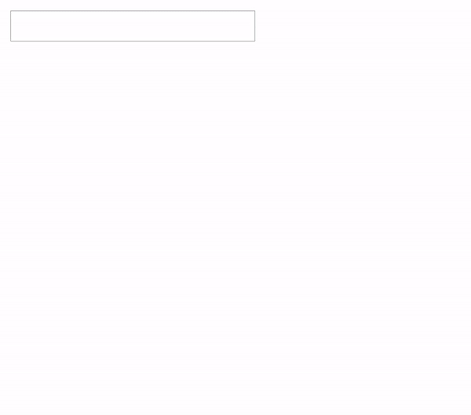

# Auto-Complete





#### TODO

- key-up, key-down 시 스크롤 자동으로 내리기
- CSS 수정 (크기 Optional)


#### Usage

```javascript
import React from 'react'
import AutoComplete from './components/auto-complete'
import './style.css'

function App() {
  const itemList = ['1번', '2번', '3번', '4번', '5번', '6번', '7번', '8번', '9번', '10번']

  return (
    <div className="App">
      <div>
        <AutoComplete itemList={itemList} />
      </div>
    </div>
  )
}

export default App

```

